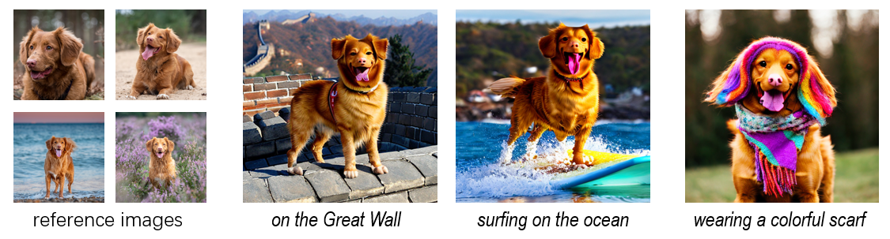
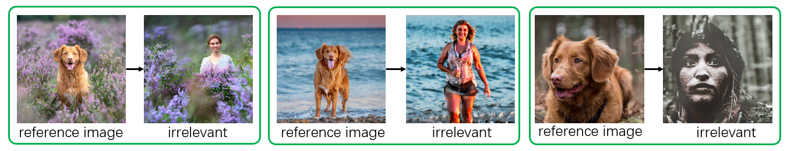
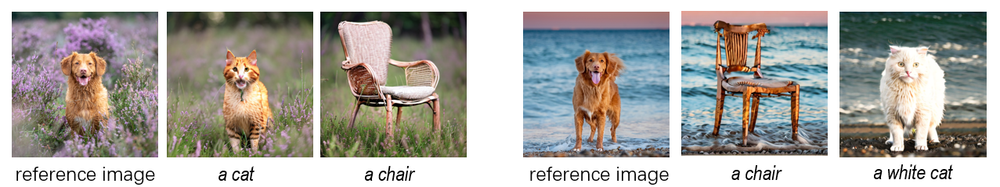
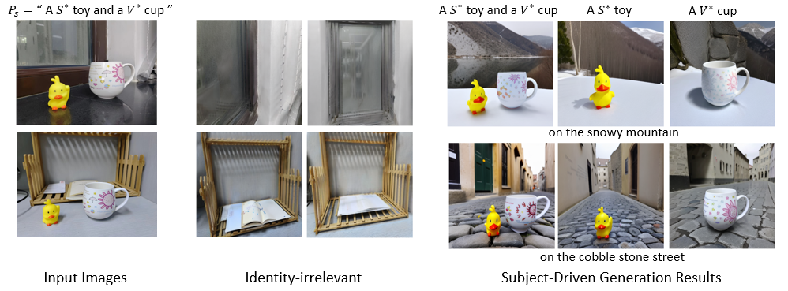

# DisenBooth: Identity-Preserving Disentangled Tuning for Subject-Driven Text-to-Image Generation [ICLR 2024]

> <a href="https://openreview.net/forum?id=FlhjUkC7vH">**DisenBooth: Identity-Preserving Disentangled Tuning for Subject-Driven Text-to-Image Generation**</a>
>
> Hong Chen, Yipeng Zhang, Simin Wu, Xin Wang, Xuguang Duan, Yuwei Zhou, Wenwu Zhu
>
> Given several reference images of a customized subject, DisenBooth, a simple but effective finetuning method, can generate customized images for the subject, little influenced by the subject-irrelevant information. Besides, DisenBooth can also be used for subject inpainting, or background customization, etc. With flexible and controllable generation ability, DisenBooth shows great potential in many scenarios.

## Applications

### Subject-driven text-to-image generation


Given several images of a subject, our model can generate customized images of the subject with any text prompt.

### Identity-irrelvant generation


DisenBooth can also generate images that contain the identity-irrelevant information of each reference image, which achieves promising disentanglement without additional supervision.

### Customization with identity-irrelevant information


With the identity-irrelevant information, we can also combine the identity-irrelevant information and other subjects to generate new images, which results in text-driven text inpainting.

### Customization when an image contain several subjects


When the input images have several subjects, we can also use DisenBooth to customize the multiple subjects. In the above example, we customize the background, the duck toy and the cup.

For more detailed description of these applications, please refer to our paper.

# Installation
Install the conda virtual environment:
```bash
pip install diffusers(0.23.1)
pip install open_clip_torch
pip install torchvision
```

# Usage

## Finetune
To customize the stable diffusion model with a new subject, you can run the following script:

```bash
CUDA_VISIBLE_DEVICES=X bash train_disenbooth.sh
```
where `INSTANCE_DIR` is the path to the input image folder, `OUT_DIR` is the path to your saved checkpoints and validation images. The `--instance_prompt` and `--validation_prompt` should be adjusted according to your customized subjects. You should also specify a model name/path of Stable Diffusion in `MODEL_NAME`. In our work, we use Stable Diffusion 2-1 base, you can try any verison of stable diffusion, but remember to use the same CLIP image encoder in line 684 in train_disenbooth.py. 


## Inference
After finetuning, we provide a inference jupyter notebook for readers to easily reproduce the results.

Note that we give released version is based on diffusers 0.23.1, newer than the version 0.13.1 we use in the paper. Some results may have little differences from the paper. 

## Citation
If you find our work useful, please kindly cite our work:
```bibtex
@inproceedings{chen2023disenbooth,
  title={Disenbooth: Identity-preserving disentangled tuning for subject-driven text-to-image generation},
  author={Chen, Hong and Zhang, Yipeng and Wu, Simin and Wang, Xin and Duan, Xuguang and Zhou, Yuwei and Zhu, Wenwu},
  booktitle={The Eleventh International Conference on Learning Representations},
  year={2023}
}
```
